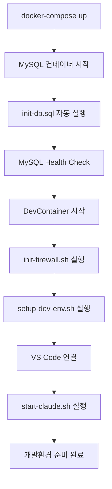

# 🐳 DevContainer 완전 가이드 - 초보자를 위한 상세 설명

Claude DevContainer 개발환경의 모든 구성 요소와 역할을 초보자도 이해할 수 있도록 설명합니다.

## 📋 목차

- [DevContainer란 무엇인가?](#devcontainer란-무엇인가)
- [Docker, Docker Compose, DevContainer 차이점](#docker-docker-compose-devcontainer-차이점)
- [컨테이너 아키텍처](#컨테이너-아키텍처)
- [스크립트 파일 상세 설명](#스크립트-파일-상세-설명)
- [데이터베이스 초기화](#데이터베이스-초기화)
- [실행 순서와 동작 방식](#실행-순서와-동작-방식)

## 💡 DevContainer란 무엇인가?

### 🎯 기본 개념

**DevContainer** = **개발환경을 Docker 컨테이너 안에 구성하는 방식**

```
일반 개발 환경:
당신의 컴퓨터 → Java 설치 → IDE 설치 → 데이터베이스 설치 → 개발

DevContainer 환경:
당신의 컴퓨터 → Docker → 컨테이너(Java+IDE+DB+모든것) → 개발
```

### ✅ 장점

- **격리성**: 컨테이너 안에서만 실행, 로컬 시스템 영향 없음
- **일관성**: 팀 모든 구성원이 동일한 환경 사용
- **이식성**: 어느 컴퓨터에서든 동일하게 실행
- **안전성**: Claude가 코드를 생성해도 격리된 환경에서만 실행

## 🏗️ Docker, Docker Compose, DevContainer 차이점

### 🐳 Docker
**단일 컨테이너를 실행하는 도구**

```bash
# 예시: 단일 MySQL 컨테이너만 실행
docker run -d mysql:8.4
```

**역할**: 하나의 애플리케이션을 컨테이너로 실행

### 🐙 Docker Compose
**여러 컨테이너를 한 번에 관리하는 도구**

```yaml
# 예시: 3개 컨테이너를 한 번에 실행
services:
  app:        # 애플리케이션 컨테이너
  mysql:      # 데이터베이스 컨테이너  
  redis:      # 캐시 컨테이너
```

**역할**: 여러 관련 서비스를 하나의 시스템으로 구성

### 🛠️ DevContainer
**개발환경 전체를 컨테이너로 구성하는 표준**

```json
{
  "name": "개발환경 이름",
  "dockerComposeFile": "docker-compose.yml",
  "workspaceFolder": "/workspace"
}
```

**역할**: VS Code/IntelliJ와 통합된 완전한 개발환경 제공

## 🏭 컨테이너 아키텍처

우리 프로젝트는 **4개의 컨테이너**로 구성됩니다:

### 📊 전체 구조도

```
┌─────────────────────────────────────────────┐
│                당신의 컴퓨터                 │
├─────────────────────────────────────────────┤
│  Docker Desktop                             │
│  ┌─────────────────────────────────────────┐│
│  │        dev-network (172.25.0.0/16)     ││
│  │                                         ││
│  │  ┌─────────────┐  ┌─────────────────┐  ││
│  │  │DevContainer │  │     MySQL       │  ││
│  │  │(개발환경)    │◄─┤   (데이터베이스) │  ││
│  │  │Java 21      │  │   mysql:8.4     │  ││
│  │  │Spring Boot  │  │   Port 3306     │  ││
│  │  │Terraform    │  └─────────────────┘  ││
│  │  │Claude Agent │                       ││
│  │  │Port 8080    │  ┌─────────────────┐  ││
│  │  └─────────────┘  │   LocalStack    │  ││
│  │                   │   (AWS 로컬)     │  ││
│  │  ┌─────────────┐  │   Port 4566     │  ││
│  │  │    Redis    │  └─────────────────┘  ││
│  │  │   (캐시)     │                       ││
│  │  │ Port 6379   │                       ││
│  │  └─────────────┘                       ││
│  └─────────────────────────────────────────┘│
└─────────────────────────────────────────────┘
```

### 🖥️ 1. DevContainer (메인 개발환경)

**스펙**:
```dockerfile
FROM alpine:3.20
Java 21 (OpenJDK)
Gradle 8.5
Terraform 1.7.5
Spring Boot CLI
AWS CLI v2
Claude Code CLI
```

**역할**:
- Claude가 코드를 생성하고 실행하는 메인 워크스페이스
- Java Spring Boot 애플리케이션 개발
- Terraform 인프라 코드 작성
- AWS 리소스 관리

**포트**:
- `8080`: Spring Boot 애플리케이션
- `3000`: 프론트엔드 개발 서버
- `5000`: 기타 서비스

### 🗄️ 2. MySQL 컨테이너 (데이터베이스)

**스펙**:
```yaml
image: mysql:8.4
character-set: utf8mb4
collation: utf8mb4_unicode_ci
```

**역할**:
- Spring Boot 애플리케이션의 메인 데이터베이스
- 개발용 샘플 데이터 제공
- 이커머스 예제 테이블 (users, products, orders)

**접속 정보**:
- 호스트: `mysql` (컨테이너 내부), `localhost:3306` (외부)
- 데이터베이스: `devdb` (개발용), `testdb` (테스트용)
- 사용자: `devuser` / 비밀번호: `devpass`

### ☁️ 3. LocalStack 컨테이너 (AWS 로컬 에뮬레이터)

**스펙**:
```yaml
image: localstack/localstack:latest
services: s3,dynamodb,lambda,sqs,sns,ses,secretsmanager,ssm
```

**역할**:
- 실제 AWS 서비스를 로컬에서 에뮬레이션
- AWS Java SDK 개발 및 테스트
- AWS 비용 없이 개발 가능

**포트**:
- `4566`: 모든 AWS 서비스 통합 엔드포인트

**사용 예**:
```bash
# S3 버킷 생성 (LocalStack)
aws --endpoint-url=http://localhost:4566 s3 mb s3://my-bucket
```

### ⚡ 4. Redis 컨테이너 (캐시)

**스펙**:
```yaml
image: redis:7-alpine
persistence: appendonly yes
```

**역할**:
- 애플리케이션 캐시
- 세션 저장소
- 임시 데이터 저장

**포트**: `6379`

## 📜 스크립트 파일 상세 설명

### 🔧 .devcontainer/init-firewall.sh

**역할**: **보안 방화벽 설정**

```bash
#!/bin/bash
# 컨테이너의 네트워크 보안을 위한 화이트리스트 방화벽
```

**기능**:
- 허용된 도메인만 외부 접속 가능
- GitHub, Maven Central, AWS 등 개발에 필요한 도메인 허용
- 악성 외부 접속 차단

**허용 도메인 목록**:
```bash
github.com          # Git 저장소
repo1.maven.org     # Maven 의존성
services.gradle.org # Gradle 플러그인  
*.amazonaws.com     # AWS 서비스
spring.io           # Spring Boot 
api.openai.com      # OpenAI API (선택)
```

**실행 시점**: 컨테이너 시작 직후 (postStartCommand)

### 🚀 .devcontainer/setup-dev-env.sh

**역할**: **개발환경 초기 설정**

```bash
#!/bin/bash
# 개발에 필요한 디렉토리, 템플릿, 도구 설정
```

**기능**:
1. **프로젝트 템플릿 생성**
   ```bash
   mkdir -p /workspace/{spring-projects,terraform-modules,docs}
   ```

2. **Spring Boot 빠른 시작 스크립트**
   ```bash
   create-spring-app.sh <project-name>
   # → Spring Boot 프로젝트 자동 생성
   ```

3. **Terraform 템플릿**
   ```bash
   create-terraform-project.sh <project-name>
   # → Terraform 모듈 구조 자동 생성
   ```

4. **Git 기본 설정**
   ```bash
   git config --global user.name "Developer"
   git config --global user.email "dev@example.com"
   ```

**실행 시점**: 컨테이너 시작 후 (postStartCommand)

### 🎯 .devcontainer/scripts/start-claude.sh

**역할**: **Claude 사용법 안내 및 환경 확인**

```bash
#!/bin/bash
# Claude 에이전트 로드 및 사용법 표시
```

**기능**:
1. **환경 상태 확인**
   - Java, Gradle, Terraform 버전 체크
   - MySQL, LocalStack 연결 상태 확인
   - Claude 에이전트 목록 표시

2. **사용법 가이드 표시**
   ```bash
   ✅ @agent:spring-boot-architect
   ✅ @agent:aws-terraform-architect
   ✅ @agent:cost-optimized-environment-manager
   ```

3. **컬러풀한 출력**
   - 성공: 녹색 ✅
   - 경고: 노란색 ⚠️
   - 오류: 빨간색 ❌

**실행 시점**: VS Code 터미널 연결 시 (postAttachCommand)

### 🔍 .devcontainer/scripts/test-connections.sh

**역할**: **모든 서비스 연결 테스트**

```bash
#!/bin/bash
# DevContainer의 모든 서비스 상태를 종합 점검
```

**테스트 항목**:

1. **MySQL 연결 테스트**
   ```bash
   mysql -h mysql -u devuser -pdevpass -e "SELECT 1"
   # 결과: ✅ MySQL 연결 성공
   ```

2. **LocalStack 서비스 테스트**
   ```bash
   curl -s http://localhost:4566/health
   # 결과: {"s3": "available", "dynamodb": "available"}
   ```

3. **Redis 연결 테스트**
   ```bash
   redis-cli -h redis ping
   # 결과: PONG
   ```

4. **외부 네트워크 테스트**
   ```bash
   curl -s https://api.github.com
   # 방화벽 허용 도메인 접속 확인
   ```

5. **개발 도구 버전 확인**
   ```bash
   java -version     # OpenJDK 21
   gradle -v         # Gradle 8.5
   terraform version # Terraform 1.7.5
   ```

**사용법**:
```bash
# 수동 실행
/workspace/.devcontainer/scripts/test-connections.sh

# 결과 예시:
✅ Java 21 ready
✅ MySQL connected  
✅ LocalStack healthy
⚠️  Redis not started (optional)
```

## 🗄️ 데이터베이스 초기화

### 📄 .devcontainer/scripts/init-db.sql

**역할**: **MySQL 데이터베이스 자동 초기 설정**

#### 🔧 수행 작업

1. **데이터베이스 생성**
   ```sql
   -- 개발용 메인 데이터베이스
   CREATE DATABASE IF NOT EXISTS devdb 
   CHARACTER SET utf8mb4 COLLATE utf8mb4_unicode_ci;
   
   -- 테스트 전용 데이터베이스
   CREATE DATABASE IF NOT EXISTS testdb 
   CHARACTER SET utf8mb4 COLLATE utf8mb4_unicode_ci;
   ```

2. **사용자 계정 설정**
   ```sql
   -- 개발용 사용자 생성
   CREATE USER IF NOT EXISTS 'devuser'@'%' IDENTIFIED BY 'devpass';
   
   -- 권한 부여 (모든 데이터베이스에 대한 전체 권한)
   GRANT ALL PRIVILEGES ON devdb.* TO 'devuser'@'%';
   GRANT ALL PRIVILEGES ON testdb.* TO 'devuser'@'%';
   ```

3. **예제 테이블 생성**

   **🧑‍💼 users 테이블 (사용자 관리)**
   ```sql
   CREATE TABLE users (
       id BIGINT AUTO_INCREMENT PRIMARY KEY,      -- 사용자 ID
       username VARCHAR(50) NOT NULL UNIQUE,      -- 로그인명
       email VARCHAR(100) NOT NULL UNIQUE,        -- 이메일
       password_hash VARCHAR(255) NOT NULL,       -- 비밀번호 해시
       first_name VARCHAR(50),                    -- 이름
       last_name VARCHAR(50),                     -- 성
       created_at TIMESTAMP DEFAULT CURRENT_TIMESTAMP,
       updated_at TIMESTAMP DEFAULT CURRENT_TIMESTAMP ON UPDATE CURRENT_TIMESTAMP,
       is_active BOOLEAN DEFAULT TRUE             -- 활성 상태
   );
   ```

   **🛍️ products 테이블 (상품 관리)**
   ```sql
   CREATE TABLE products (
       id BIGINT AUTO_INCREMENT PRIMARY KEY,      -- 상품 ID
       name VARCHAR(200) NOT NULL,                -- 상품명
       description TEXT,                          -- 상품 설명
       price DECIMAL(10, 2) NOT NULL,            -- 가격
       category_id BIGINT,                       -- 카테고리
       sku VARCHAR(50) UNIQUE,                   -- 상품 코드
       stock_quantity INT DEFAULT 0,             -- 재고 수량
       is_active BOOLEAN DEFAULT TRUE,           -- 판매 상태
       created_at TIMESTAMP DEFAULT CURRENT_TIMESTAMP,
       updated_at TIMESTAMP DEFAULT CURRENT_TIMESTAMP ON UPDATE CURRENT_TIMESTAMP
   );
   ```

   **📦 orders 테이블 (주문 관리)**
   ```sql
   CREATE TABLE orders (
       id BIGINT AUTO_INCREMENT PRIMARY KEY,      -- 주문 ID
       user_id BIGINT NOT NULL,                   -- 주문자
       order_number VARCHAR(50) UNIQUE NOT NULL,  -- 주문번호
       status ENUM('PENDING', 'CONFIRMED', 'SHIPPED', 'DELIVERED', 'CANCELLED'),
       total_amount DECIMAL(10, 2) NOT NULL,     -- 총 금액
       order_date TIMESTAMP DEFAULT CURRENT_TIMESTAMP,
       shipped_date TIMESTAMP NULL,
       delivered_date TIMESTAMP NULL,
       FOREIGN KEY (user_id) REFERENCES users(id)
   );
   ```

   **📋 order_items 테이블 (주문 상세)**
   ```sql
   CREATE TABLE order_items (
       id BIGINT AUTO_INCREMENT PRIMARY KEY,
       order_id BIGINT NOT NULL,                  -- 주문 ID
       product_id BIGINT NOT NULL,               -- 상품 ID
       quantity INT NOT NULL,                    -- 수량
       unit_price DECIMAL(10, 2) NOT NULL,      -- 단가
       total_price DECIMAL(10, 2) GENERATED ALWAYS AS (quantity * unit_price) STORED,
       FOREIGN KEY (order_id) REFERENCES orders(id),
       FOREIGN KEY (product_id) REFERENCES products(id)
   );
   ```

4. **샘플 데이터 삽입**
   ```sql
   -- 테스트 사용자
   INSERT INTO users (username, email, password_hash, first_name, last_name) VALUES 
   ('admin', 'admin@example.com', '$2a$10$N.zmdr9k7uOCQb376NoUnuTJ8iYqiSfFe5NQZaK9RaNxy5bKQ0JLG', 'Admin', 'User'),
   ('developer', 'dev@example.com', '$2a$10$N.zmdr9k7uOCQb376NoUnuTJ8iYqiSfFe5NQZaK9RaNxy5bKQ0JLG', 'Dev', 'User');
   
   -- 샘플 상품
   INSERT INTO products (name, description, price, sku, stock_quantity) VALUES 
   ('Sample Product 1', 'This is a sample product for testing', 29.99, 'SP-001', 100),
   ('Sample Product 2', 'Another sample product', 49.99, 'SP-002', 50);
   ```

5. **성능 최적화 인덱스**
   ```sql
   -- 자주 검색되는 컬럼에 인덱스 추가
   CREATE INDEX idx_username ON users(username);
   CREATE INDEX idx_email ON users(email);
   CREATE INDEX idx_product_name ON products(name);
   CREATE INDEX idx_order_status ON orders(status);
   ```

6. **개발용 뷰 생성**
   ```sql
   -- 사용자별 주문 요약 뷰
   CREATE VIEW user_order_summary AS
   SELECT 
       u.username,
       COUNT(o.id) as order_count,
       SUM(o.total_amount) as total_spent,
       MAX(o.order_date) as last_order_date
   FROM users u
   LEFT JOIN orders o ON u.id = o.user_id
   GROUP BY u.id, u.username;
   ```

**실행 시점**: MySQL 컨테이너 최초 시작 시 자동 실행

**확인 방법**:
```bash
# 데이터베이스 확인
mysql -h mysql -u devuser -pdevpass devdb -e "SHOW TABLES;"

# 샘플 데이터 확인
mysql -h mysql -u devuser -pdevpass devdb -e "SELECT * FROM users;"
```

## ⚡ 실행 순서와 동작 방식

### 🚀 컨테이너 시작 순서



### 📋 단계별 상세 설명

#### 1️⃣ MySQL 초기화 (30초)
```bash
mysql:
  healthcheck:
    test: ["CMD", "mysqladmin", "ping"]
    interval: 10s
    retries: 5
```
- MySQL 8.4 컨테이너 시작
- `init-db.sql` 스크립트 자동 실행
- 데이터베이스, 사용자, 테이블, 샘플 데이터 생성
- Health check로 준비 상태 확인

#### 2️⃣ DevContainer 빌드 및 시작 (2-3분)
```dockerfile
FROM alpine:3.20
RUN install java, gradle, terraform...
```
- Alpine Linux 기반 이미지 빌드
- Java 21, Gradle 8.5, Terraform 1.7.5 설치
- 필요한 개발 도구 설치

#### 3️⃣ 보안 방화벽 설정 (5초)
```bash
postStartCommand: "sudo /usr/local/bin/init-firewall.sh"
```
- 화이트리스트 기반 방화벽 활성화
- 개발에 필요한 도메인만 허용

#### 4️⃣ 개발환경 구성 (10초)
```bash
/usr/local/bin/setup-dev-env.sh
```
- 워크스페이스 디렉토리 구조 생성
- Git 기본 설정
- 프로젝트 템플릿 준비

#### 5️⃣ VS Code 통합 (10초)
```json
"customizations": {
  "vscode": {
    "extensions": ["anthropic.claude-code", "vscjava.vscode-java-pack"]
  }
}
```
- VS Code 확장 프로그램 자동 설치
- Java, Spring Boot, Terraform 개발 환경 구성
- Claude Code 에이전트 로드

#### 6️⃣ Claude 환경 표시 (즉시)
```bash
postAttachCommand: "/usr/local/bin/start-claude.sh"
```
- 컬러풀한 환경 상태 표시
- 사용 가능한 Claude 에이전트 목록
- 빠른 시작 가이드 제공

### 🎯 최종 결과

**준비 완료된 개발환경**:
- ✅ Java 21 + Spring Boot 3.3 개발환경
- ✅ MySQL 8.4 + 샘플 데이터
- ✅ AWS SDK 테스트용 LocalStack
- ✅ 33개 Claude 전문 에이전트
- ✅ 보안 격리된 네트워크
- ✅ 팀 표준 개발 도구

**Claude 사용 준비 완료**:
```bash
@agent:spring-boot-architect
"이커머스 REST API를 만들어줘"
# → /workspace에 완전한 Spring Boot 프로젝트 생성
```

## 🔧 문제 해결

### ❌ 컨테이너 시작 실패
```bash
# 상태 확인
docker-compose ps

# 로그 확인  
docker-compose logs devcontainer
docker-compose logs mysql
```

### ❌ MySQL 연결 실패
```bash
# MySQL 컨테이너 상태 확인
docker exec -it claude-mysql mysql -uroot -prootpass -e "SELECT 1"

# 데이터베이스 재초기화
docker-compose down -v
docker-compose up -d
```

### ❌ 방화벽 문제
```bash
# 방화벽 상태 확인
docker exec -it claude-dev-env iptables -L

# 방화벽 재설정
docker exec -it claude-dev-env /usr/local/bin/init-firewall.sh
```

이제 DevContainer의 모든 구성 요소와 동작 방식을 완벽히 이해하셨을 것입니다! 🚀